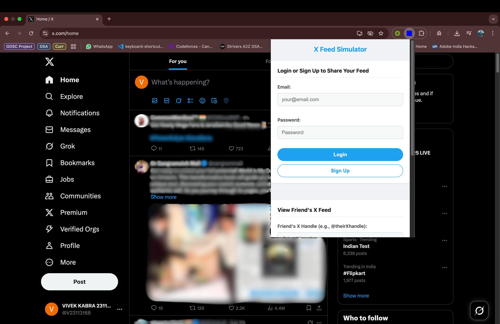
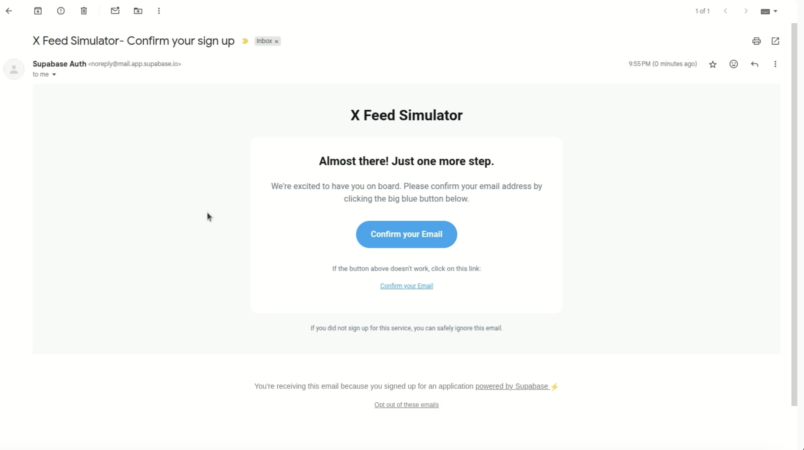
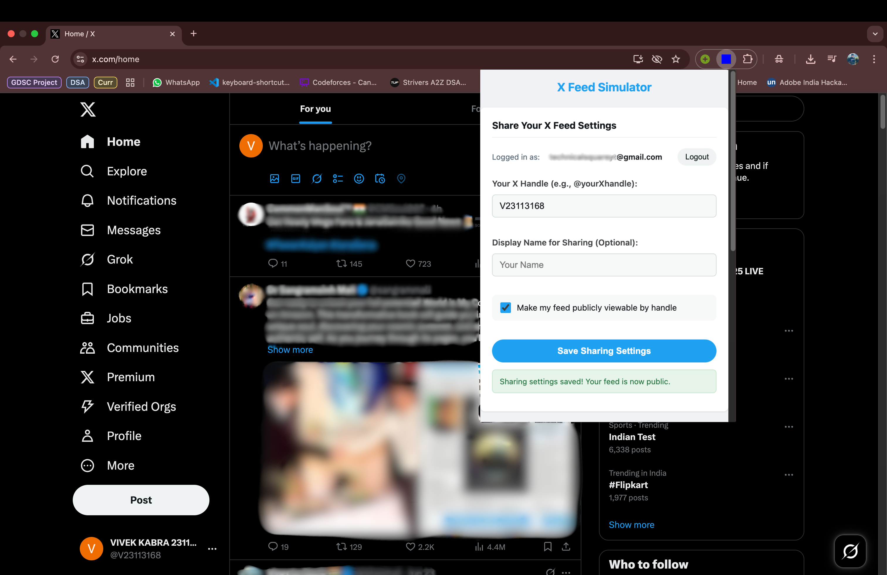
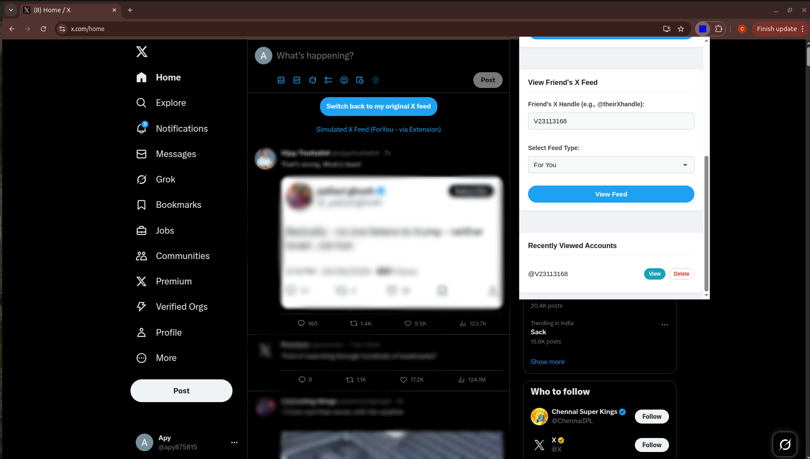
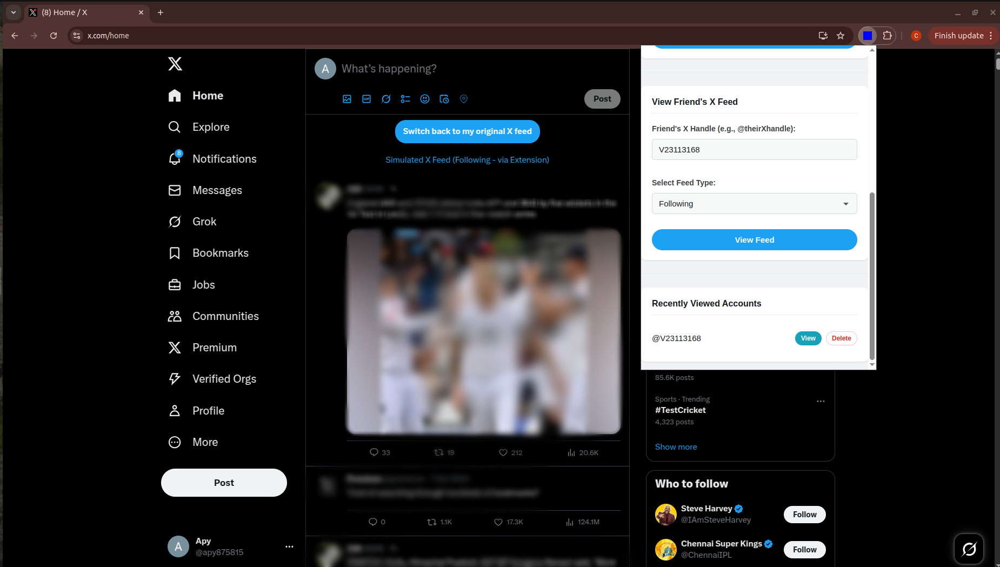
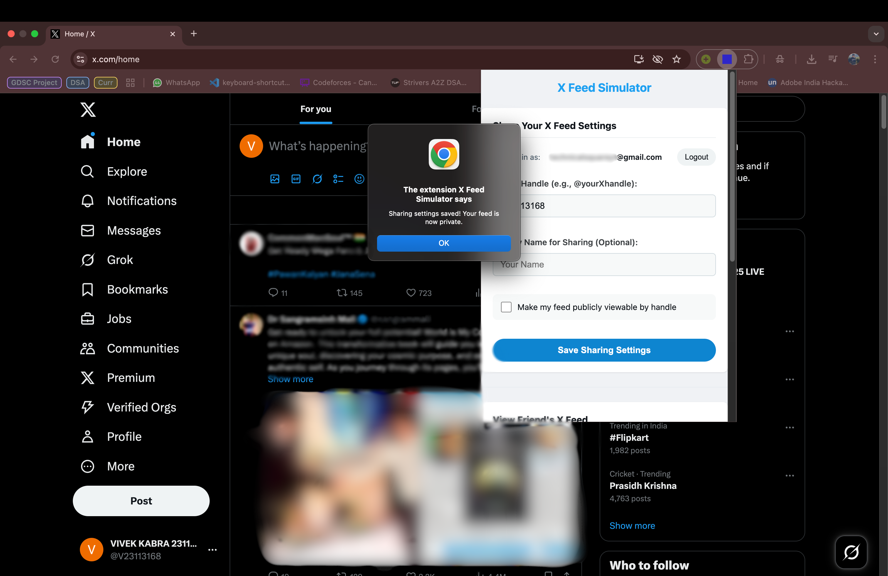

# X Feed Simulator

**View how your friend’s X (formerly Twitter) feed looks! This browser extension allows users to share their X feed perspective in a read-only mode, and for others to view those shared feeds.**

## Overview

This project is a browser extension that enables users to:
1.  **Share their X.com Feed:** Authenticated users can choose to make their X feed (either "Following" or "For You" timeline) publicly viewable by others through this extension. This involves the extension securely capturing their X.com session details and storing them with user consent via our backend.
2.  **View Shared Feeds:** Other users can then enter the X handle of a person who has shared their feed and view that person's timeline directly within their own X.com interface, replacing their own feed temporarily.
3.  **Read-Only & Secure:** Viewing is strictly read-only, ensuring no actions can be taken on behalf of the sharer. User X.com tokens are encrypted when stored.

## Built with


![RESTAPI](https://img.shields.io/badge/rest-40AEF0?style=for-the-badge&logo=data%3Aimage%2Fpng%3Bbase64%2CiVBORw0KGgoAAAANSUhEUgAAAGQAAABkCAYAAABw4pVUAAAACXBIWXMAAAsTAAALEwEAmpwYAAAIn0lEQVR4nO2dWYwWRRDHR1RExQsRIkjEDUaNEhEVNOFBxYsHIpcYV5EX0fVKvBDRiC8eD95ooqIPSjiMSjTCg2iiRgUExESFNVE5ohiNCBqFXRHYn2m2Nxlqe47u6dnvm%2Fnmn%2BwD7M6%2Fqqtm%2Bqiurg6CChUqVKhQocQApgJrgHbs0a6fnVLrdpQCwD34w521bk%2BhARzv%2BFVEQXH1q3W7CgtgOv4xvdbtKiyAF4QxH3XgeExwPJ%2BPtg0AYJUw5iQHjsmCY2U%2B2pYcwMHALmHMkx14hgoOxXlIPlqXGMBIYchtGbi2Ca6RfrUtKYDDgPHAfMPX8X4G3uWC619gKXADcITfVpQAwJnAq8CfROOxDPxyYA9DyXwFOCNodADDgTeBfcRjn%2FpyMsgZn1LGG8BZQaMBOBVYAnTEGOgPYAFwLdDfg8z%2Bmktxbk9wzNvAsKBBZk4zgbYIY%2BwF3gEmAL1z1KO3lvGulmmC0vFepXNQ4u5pbUTj1QD%2BLHBKDfRqAp4zTCK6oAKTw4MyAbgZ%2BM%2FQ2D3AS8CgOtBxMPCy1kliNzAjqHcAF%2Bpo7AzTLEV3UU9HvHlqFX52UGcARgBfROj8lKkLU20HbgLuAy6qhdK99aAs8TXwgO4G%2Buq5vultU07sFdQpgF5aR6WrxHu6bU26rarNEmrdc2RPKvwiyTDNZDYC5wYFAXCu1jlN2yQW96SSSXN6Ez4HBgQFA9AP%2BAg3XJ63cgcZIrCtwAcRg2EX1ILr0KCgoLOLVgvYKKip84faFmF8k%2Bu0GZgmBKqF3ZjQwmuGwTmvlWEuT%2BcE5XXhBPXltAAn6L8ZY1jstuSlkBrIfknTT2rnKEWfKIMzhFNUm24HBgYGKJsIG%2F0OHBv4hiFA1%2BayP1F2ACcBO4WtnvYtpMmQbPCQVyElAjBH2Eotik%2FzKUDFl8L4qdpHiAZwOLBZ2GxZ4APAJXTH1V7Iy5%2FcJ3Glj0FMTd3C%2BExNf71pXmIAHwvbtWaa%2FuvZRBj7irTSrjVUrM4Q3r8jyzRXhghe8q51yUFnNDuM7U5xLuB6w97z%2FgVQhfRQNjPkCjS7ED0oSBZZk1TYD2U7YcvZgYcwicIz9Rw29wU18PqYuOgwvrIZPr6Qo4GtBrK3gD5ZlQ2leW7TPxMdnk0TBt%2BpA6K3xe3T6y5ahTkkNgHjHNrWR9tK4mfgKFu%2BLtJREblSn2ZN69dvocos6cLvNlNC4FfssQ44MUKXqMQLha0OIXtlIwlly%2FNtuKKSE0xfSmuWpARgrIFzrMXzrvhSOl5nTO7y4RBlE0MYfj%2BHt2QJYAiw3iDEObUfmGvgm2vxfBbcYuBrBn7L2mUpmxg4lO2G2NgnjaDjgO%2BFIOdze8AWg%2BJbLJ4%2FAAnZJEvTHklIyxvz%2FBRBoWx2nC1PWmHh%2FeUO13WJzuyIwoiUHKkNp0PiYfztgzfi%2BQFik2qjLYfNQBUWtN5jeDqMOSk5rAyX9u%2BzOkRzfBei6MjlXCNwhdB1fgaur2Icsq4EDlkoaC5z4UkSonKQwpiZYYIQ%2FtI6DP8eUnCH3C9o7nfhSRIi94qvcuRRC7QwvjJ8MbcV3CETBc1CF54kISt9HAvTWSlhqPHkYfF%2FywvukPMFzWcuPElC1LZtGCc6cBxjSM88R%2F%2BEof7mmASuA5BCdqq%2Ft%2BWNmWo7TedthPwlhBztwHGNVFQn3x1kWJdck8BVl9Pe0IsXxg4XniQh8jjBoR5mH8%2FHrHAXJnClMpx2xrKeWhiGYmNh7HbhydUhWkkZqLw09PtLxe%2F%2BjJNBNrSUwSGZuixDMPEAg0c4bGwMnyvW2Djapo093WXJQX1QxmDiohQ7a3Nj%2BFywNmkyUqRBfYUQcp7l84mDNoZBP4YvLf7Rurek6WaLNO2Vb%2B8ET8HEJIzIy3BFXxjOFkJmWTwrF342mFNAhzjbykbIZULIAk%2FBxCSsK6BDFkXNJvMMv29wDCbaosMUbKxzh%2BQffteCfhSCBjiko7ZaNsgYbEQgS7ty3qD6wZduXrZwDaWRHk%2FxzONJwcY6dkj%2BW7hZkhwM6TWjUzwzWjzTlrdDfOVl5Z7kkDUNyPBcYkYgncHGWIP7dIjPvKxc04B8JMrpN6wLmyxkb4p7zpU3Qpa3vKzcEuV8pZKqz13zbLX89MfFPefKGyPPS15WilTSrU6ppIbjCA2TbO0LMcnW17mQVccR6uw4QnVgp84O7FRH2urpSJsmu0OQVYc%2BLaCj3PLQ561ZCA8BvjWUWaqORacA8Imw3YbMZc4jznFMzUTaAKD7Zpu%2F%2BlmGrI2qtIZ9aY0lgS%2BoosK6Xrp1lnojgu4bcv96L8xsqC5alWdKX57pkcA3VBEuQzQ0qoDZQL0PUtYCZi1R5c8NSemq6FvfvBRSikSV%2BDtB%2F%2F4jMdUra4m%2FPTpxfEaXcyJK%2FE3LWylZHahVF4CMqqGOLiCZWy33vKGjwapAfxS6nCPD7qtyXyIAF%2BOGopaJPd5QZikN1CJ6VE8pKftJE7ZHhLKtEuxqCZ3wtjll2yRe7ElFjzTslZtKjauy3BjOfsys5zA%2BnV3zrIgLBNKUGq9NF60Kz%2Bs7NuKK8asC9iasTnsEuiehDw%2BphGwTnowpxq9scDdwQVDv0MrujhgM1RURg%2Btk%2FTAv5rqKG4MyQd3tpL8KE9r0pSpNNdBrmL5RNOrO3dWlvZdKd2H3xCQU7NXXEE3M%2BcojNY2dpMeDqIsFdmldC7%2BGSvtWvpVwy8J2fQSu2eOlYM16O3VHjNx9WrfyXwoW0Y0trqNr8xaXtnuygZ6lzEt4c%2FO6WHKHnlic7rdV5b96dXkGXlmsoLp61cGII4URq8uJ62BGtlM4ZagDj8q1DaO6vttjfZXJHo4HrHBWqNFB99R%2B64HdcNYkdV3HCgLAdPxjupRTwW4vot2jM9pzO%2B%2FXKADu8uiQO2vdnlKAzoF5tePX0qbvtnUuaVuhQoUKFSoEBcD%2FXUq53%2FegDjAAAAAASUVORK5CYII%3D&logoColor=white)


## Features

*   **User Authentication:** Sharers authenticate using **Email and Password** (powered by Supabase Auth) to manage their sharing settings.
*   **Consent-Based Sharing:** Sharers have explicit control via a toggle to make their X feed public or private through this extension.
*   **X Handle Lookup:** Viewers can find and load a shared feed by entering the sharer's X handle.
*   **Feed Type Selection:** Viewers can choose to see either the "Following" or "For You" timeline of the shared feed.
*   **Rich Feed Display:** The simulated feed aims to replicate the X.com experience, showing:
    *   Tweet text with clickable `@mentions`.
    *   Author information (name, handle, avatar).
    *   Timestamps formatted relatively (e.g., "3h", "Oct 27").
    *   Tweet engagement stats (replies, reposts, likes, views) with icons.
    *   Embedded media (images, videos, GIFs).
    *   Themed display adapting to X.com's light or dark mode.
*   **Read-Only Viewing:** Ensures privacy and security for the sharer's account.
*   **"Switch Back" Functionality:** Easily revert to your own X feed with a single click.
*   **Recently Viewed List:** The extension locally saves handles of feeds you've successfully viewed for quick access.

## Tech Stack

*   **Frontend (Browser Extension):**
    *   HTML5, CSS3, JavaScript (Manifest V3)
*   **Backend:**
    *   Python
    *   Flask (for the API server)
    *   Twikit (Python library for interacting with X.com)
    *   Supabase Python Client (`supabase-py`) for server-side interaction with Supabase.
    *   `python-dotenv` (for environment variable management)
    *   `cryptography` (for encrypting/decrypting X.com tokens)
    *   **Deployment:** Render
*   **Database & Auth Service:**
    *   Supabase (PostgreSQL database, Email/Password Authentication, Row Level Security)
    *   Supabase Client JS (`supabase-js`) for authentication and session management.

## Project Structure

```
x-feed-extension/
├── .gitignore # Specifies intentionally untracked files 
├── backend/
│ ├── app.py # Flask backend application
│ ├── Procfile # For deployment platforms (e.g., Render)
│ ├── requirements.txt # Backend Python dependencies
├── frontend/
│ ├── images/ # Extension icons
│ │ ├── icon16.png
│ │ ├── icon48.png
│ │ └── icon128.png
│ ├── content.js # Injects feed content into X.com page
│ ├── injected-styles.css # CSS for the injected feed content
│ ├── manifest.json # Extension manifest file
│ ├── popup.html # HTML for the extension popup
│ ├── popup.js # JavaScript logic for the popup
│ ├── style.css # CSS for the popup
│ └── supabase.js # Local copy of Supabase client library
├── verification-site/ # Directory for domain verification purposes (if needed)
│ └── index.html # Email confirmation webpage
├── screenshots # Screenshots of extension working
└── README.md # This file (main project README)
```

## Installation

This extension is not yet published on the Chrome Web Store. You can install it manually using the steps below.

1.  **Download the Extension:**
    *   Go to the [**Releases** page](https://github.com/atharv-pdarshi/x-feed-extension/releases/latest) of this repository.
    *   Download the `x-feed-simulator-v1.0.zip` file from the latest release.

2.  **Unzip the File:**
    *   Unzip the downloaded file. You should now have a folder named `x-feed-simulator-v1.0` (or similar) containing files like `manifest.json`, `popup.html`, etc.

3.  **Install in Chrome:**
    *   Open your Chrome browser and navigate to `chrome://extensions`.
    *   In the top right corner, turn on the **"Developer mode"** toggle.
    *   Three new buttons will appear. Click the **"Load unpacked"** button.
    *   A file selection dialog will open. Navigate to and select the **entire unzipped folder** you created in step 2.
    *   The "X Feed Simulator" extension will now appear in your list of extensions, ready to use!


## Workflow Overview

**For Users Wishing to Share Their Feed (Sharers):**
1.  Open the extension popup.
2.  Sign up for a new account or log in using their Email and Password. This authentication is handled by Supabase.
3.  Once logged in, navigate to the "Share Your X Feed Settings" section.
4.  Enter their X.com handle and optionally a display name.
5.  Enable the toggle "Make my feed publicly viewable by handle."
6.  Click "Save Sharing Settings." The extension then securely processes their X.com session details with the backend, which stores them encrypted in the Supabase database and marks the feed as public.
7.  To stop sharing, the user can toggle sharing off and save.

**For Users Wishing to View a Shared Feed (Viewers):**
1.  Open the extension popup while on X.com.
2.  In the "View Friend's X Feed" section, enter the Sharer's X handle.
3.  Select the desired feed type ("Following" or "For You").
4.  Click "View Feed." The extension contacts the backend, which verifies if the target feed is public and then uses stored tokens to fetch and return the feed data.
5.  The `content.js` script renders this feed onto the X.com page.
6.  Viewed handles are saved locally in "Recently Viewed Accounts" for quick access.
7.  The "Switch back to my original X feed" button reloads the page to the user's own feed.

## Screenshots
#### Main view:

#### Confirming account after signing up:

#### After signing up and logging in:

#### Made X feed publicly viewable:

#### Publicly available feed is accessed (Feed type: For you):

#### Publicly available feed is accessed (Feed type: Following):

#### Made X feed private:


## Key Features Demonstrated
*   Secure sharer authentication (Email/Password via Supabase).
*   User consent mechanism for feed sharing.
*   Secure storage and retrieval of X.com tokens (encrypted in Supabase, managed by backend).
*   Viewing feeds by X handle.
*   Selection between "Following" and "For You" timelines.
*   Dynamic injection and rendering of a custom feed UI onto X.com.
*   Display of tweet text, author details, media (images/videos), formatted timestamps, and engagement statistics (replies, reposts, likes, views) with SVG icons.
*   Adaptive theming (light/dark mode) for the injected feed.
*   Local list of recently viewed accounts.

## Future Enhancements (Potential Ideas)
*   More robust error handling and user feedback.
*   Ability for sharers to approve specific viewers instead of just a public toggle.
*   More sophisticated UI/UX for the popup and injected feed.
*   Packaging for the Chrome Web Store.


